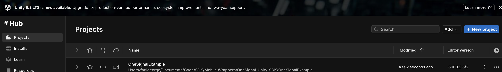
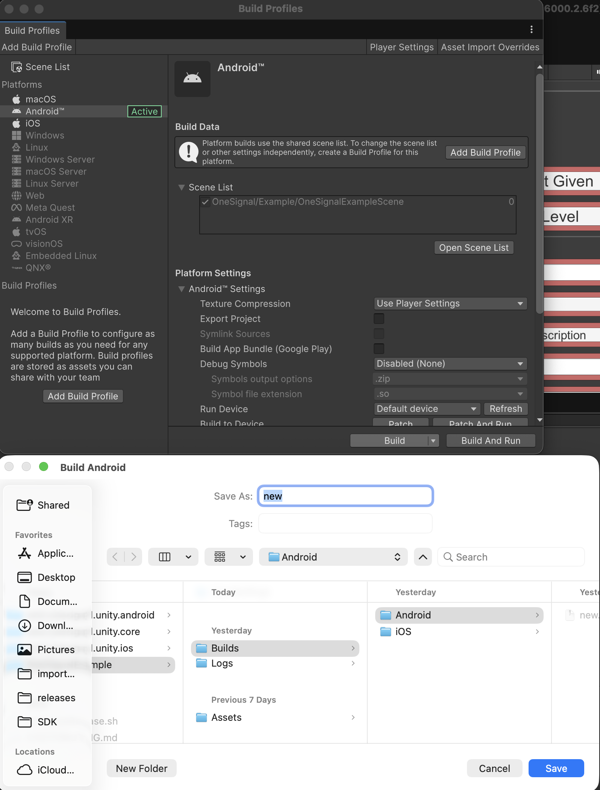
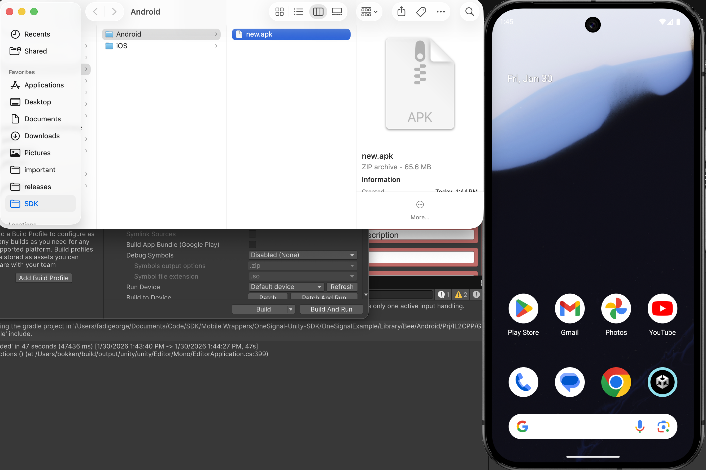
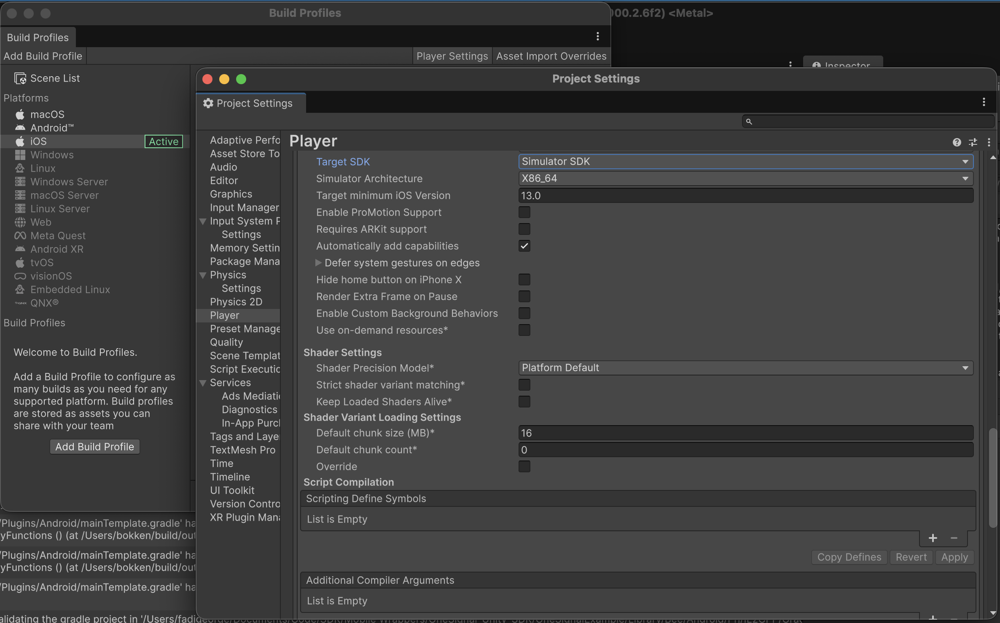
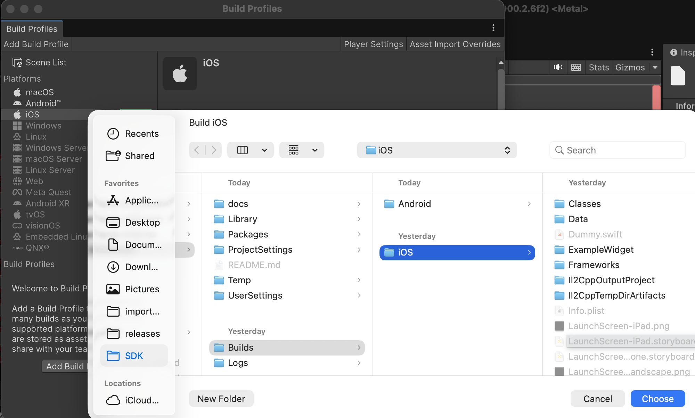

# Testing on Example App

First try to use a more recent Unity version for testing on the emulators.

### Android

Check your build profiles and make sure Android platform is selected.  
Then click build and select a location for the apk bundle.

Then have an emulator running and drag the apk to the emulator to install it. Then test what OneSignal functionality you want.

### iOS

Check your build profiles and make sure iOS platform is selected.  
Then configure your play settings and set `Target SDK` to `Simulator SDK`

Then click `Build and Run` and select a location for the apk bundle. Or click `Build` to use own simualtor.

