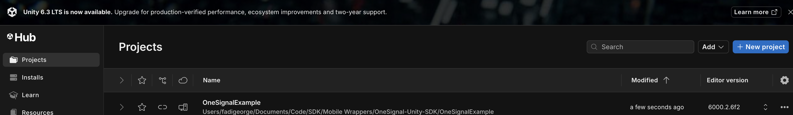
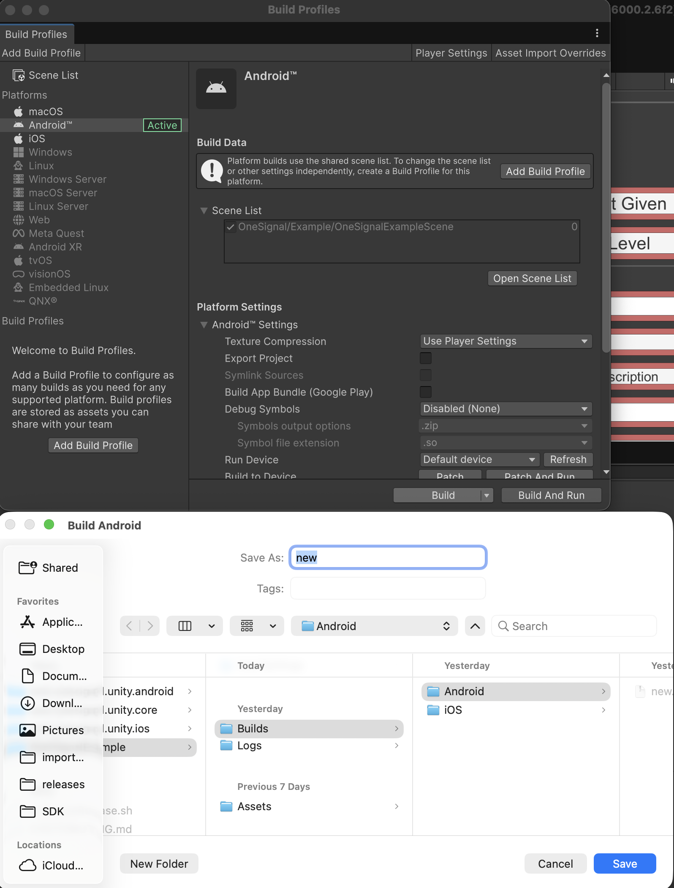
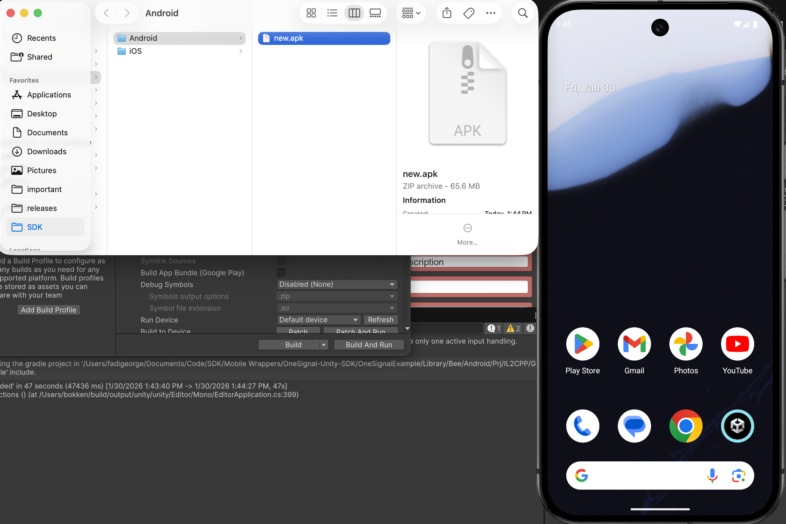
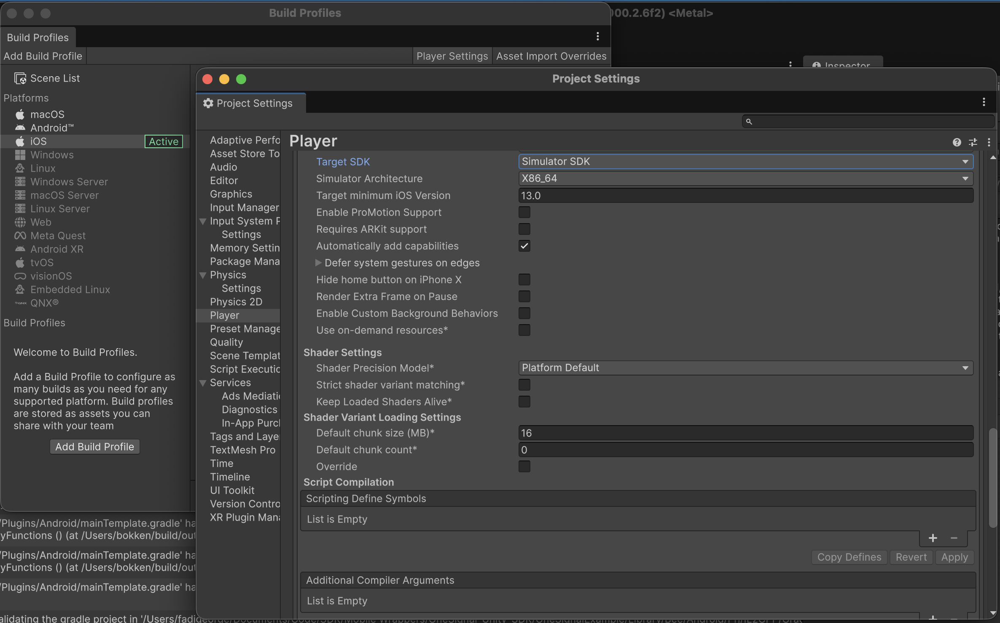
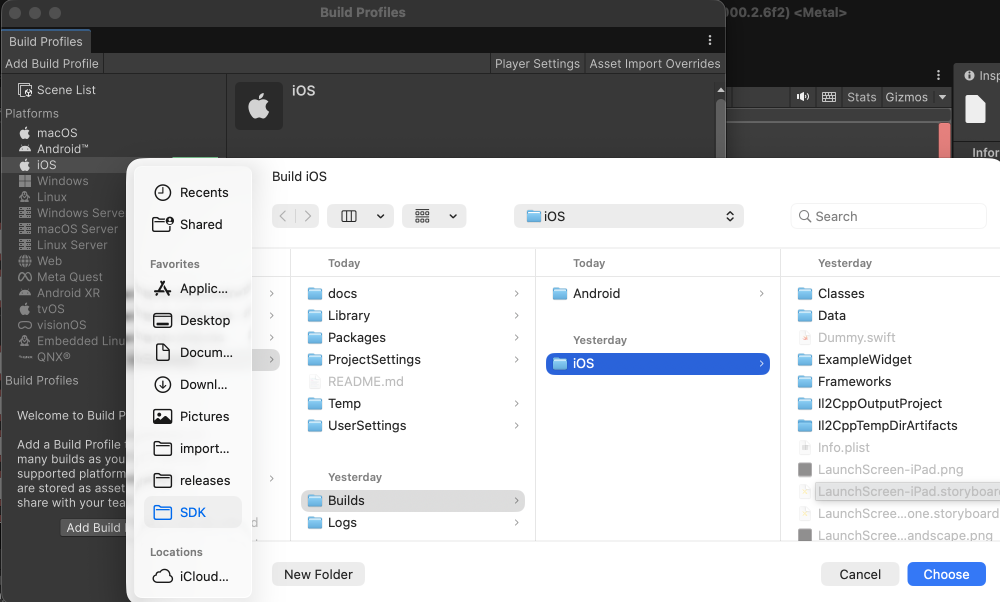

# Testing on the Demo App

First try to use a more recent Unity version for testing on the emulators.

## Publishing to the Asset Store

To upload or update the package on the Unity Asset Store, install the [Asset Store Tools](https://assetstore.unity.com/packages/tools/utilities/asset-store-publishing-tools-115) from **Window > Package Manager** within the Unity Editor.



## Command Line

You can build and install without opening the Unity editor by using the provided scripts. Have an emulator/simulator booted first, then run:

```sh
# Android — builds APK and installs on a running emulator
./run-android.sh

# iOS — generates Xcode project, builds, and installs on a booted simulator
./run-ios.sh
```

Both scripts accept `--no-install` to build only, `--install-only` to skip rebuilding, and `run-ios.sh` also supports `--open` to open the generated Xcode workspace. Set `UNITY_PATH` if Unity is not at the default location.

### Unity versions

The demo can be opened directly in Unity 2022.3 or Unity 6. The E2E workflow enables Unity 6's Accessibility module only for automated builds because that module is not available in Unity 2022.3.

## Clean Generated State

Use `clean.sh` when you want to retest setup from the Unity Editor or clear build artifacts before switching between dependency configurations:

```sh
./clean.sh
```

The script removes Unity-generated folders such as `Build/`, `Library/`, `Temp/`, `Obj/`, `Logs/`, and `UserSettings/`. It also removes the generated OneSignal dependency manifest XML files while preserving their `.meta` files so Unity GUIDs remain stable:

```text
Assets/OneSignal/Editor/OneSignalAndroidDependencies.xml
Assets/OneSignal/Editor/OneSignaliOSDependencies.xml
```

After running it, reopen the project in Unity. The OneSignal Editor setup code should regenerate those manifests for the default location-enabled dependency set.

## Unity Editor

### Android

Check your build profiles and make sure Android platform is selected.  
Then click build and select a location for the apk bundle.



Then have an emulator running and drag the apk to the emulator to install it. Then test what OneSignal functionality you want.


### iOS

Check your build profiles and make sure iOS platform is selected.  
Then configure your play settings and set `Target SDK` to `Simulator SDK`


Then click `Build and Run` and select a location for the apk bundle. Or click `Build` to use own simulator.


